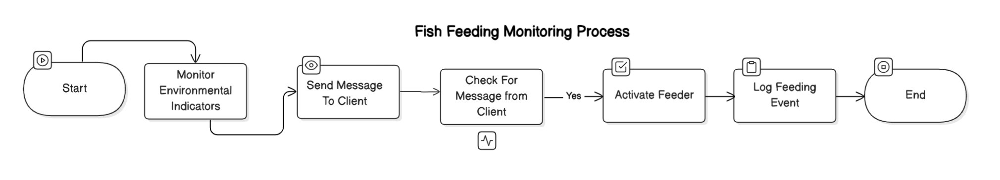

# Aqua Matic  
# **Smart Aquarium Management System** 🐠
 

## **📌 Project Overview**  
**Aqua Matic** is a smart, automated aquarium management system that uses a **PIR sensor and Pi-camera** to detect fish presence and regulate feeding schedules. 
For the people who love their goldies but can’t always be there—Aqua Feed Pi ensures your fish are fed, happy, and thriving, even when you're away! 🐠✨
Designed with Raspberry Pi, this project helps automate fish feeding efficiently, ensuring optimal care even when you're away.  

## **🚀 Features**  
✅ **Automated Feeding:** Dispenses food when fish are detected.  
✅ **PIR & Camera-based Detection:** Monitors fish activity for intelligent feeding.  
✅ **Remote Access:** Control and monitor the system via SSH or a web dashboard.  
✅ **Configurable Parameters:** Adjust feeding schedules and sensor sensitivity.  
✅ **Energy Efficient:** Optimized to reduce unnecessary food waste.  

---

## **🔧 System Components**  

- **Hardware:**  
  - Raspberry Pi  
  - PIR Motion Sensor  
  - Camera Module  
  - DC Motor (for feeding mechanism)  
  - Power Supply  
  - Wi-Fi Module (optional, for remote access)  

- **Software:**  
  - Cpp (for system control)  
  - OpenCV (for fish detection via camera)  
  - RPi.GPIO (for PIR and  motor control)  
  - Next.js (for web-based monitoring, if enabled)  

---
 

## **🛠 Installation & Setup**  

### **1️⃣ Clone the Repository**  
Make sure you have **Git** installed, then run:  

```bash
git clone https://github.com/Deshad/Aqua_Feed_Pi.git
cd Aqua_Feed_Pi
```

### **2️⃣ Install Dependencies**  
Run the following command to install required Python libraries:  

```bash
pip install -r requirements.txt
```

### **3️⃣ Setup Raspberry Pi Configuration**  

#### **Enable Camera**  

```bash
sudo raspi-config
```
- Navigate to *Interfacing Options* → *Enable Camera* → *Finish & Reboot*.  

#### **Enable PIR Sensor GPIO**  
Ensure you have connected the PIR sensor properly to the Raspberry Pi's GPIO pins.  

---

## **🚀 Running the System**  

Execute the main script:  

```bash
./ feed_fish
```

---

## **🛠 Configuration**  

Modify `config.json` to adjust:  
- Feeding schedule  
- PIR sensor sensitivity  
- Camera threshold settings  

---

For web-based monitoring, run:  

```bash
----(add command here)
```
Then, access the dashboard via your browser at `http://[link]/`.  

---

## **🐟 Troubleshooting**  

| Issue | Solution |
|--------|----------|
| Camera not detected | Run `vcgencmd get_camera` and check if `detected=1`. |
| PIR sensor not triggering | Check GPIO connections and ensure the correct pin mapping. |
| Motor not working | Ensure it’s connected properly and receiving the correct PWM signal. |

---

## **🤝 Contributing**  

Contributions are welcome! If you’d like to improve the system, open an issue or submit a pull request.  

---

## **📜 License**  

This project is open-source under the MIT License.  


