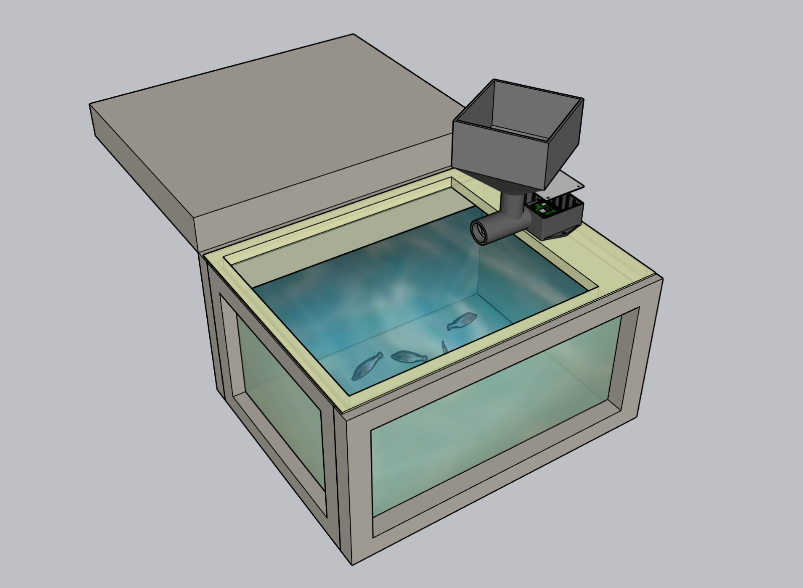
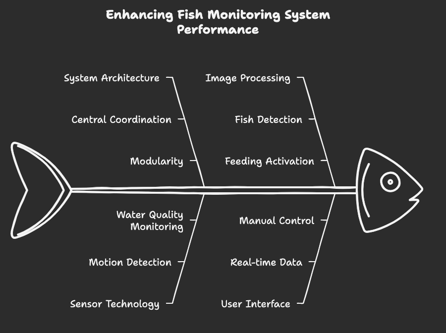
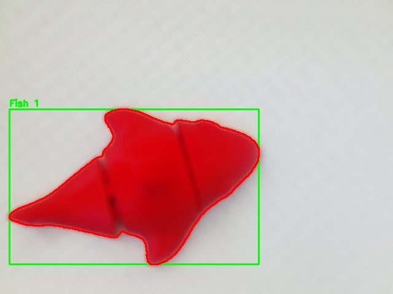

# Aqua Matic  
# **Smart Aquarium Management System** 🐠
 

## **📌 Project Overview**  
**Aqua Matic** is a smart, automated aquarium management system that uses a **PIR sensor and Pi-camera** to detect fish presence and regulate feeding schedules. 
For the people who love their goldies but can’t always be there—Aqua Feed Pi ensures your fish are fed, happy, and thriving, even when you're away! 🐠✨
Designed with Raspberry Pi, this project helps automate fish feeding efficiently, ensuring optimal care even when you're away.  

## **🚀 Features**  
✅ **Automated Feeding:** Dispenses food when fish are detected.  
✅ **PIR & Camera-based Detection:** Monitors fish activity for intelligent feeding.  
✅ **Remote Access:** Control and monitor the system via SSH or a web dashboard.

✅ **pH Monitoring:** Monitor pH value of the tank. 

✅ **Configurable Parameters:** Adjust feeding schedules and sensor sensitivity.  
✅ **Energy Efficient:** Optimized to reduce unnecessary food waste.  

---

## **🔧 System Components**  

- **Hardware:**  
  - Raspberry Pi  
  - PIR Motion Sensor  
  - Camera Module
  - pH Sensor    
  - DC Motor (for feeding mechanism)  
  - Power Supply  
  - Wi-Fi Module (optional, for remote access)
    

- **Software:**
  - OS (for Raspberry Pi system)
  - Cpp (for system control)  
  - OpenCV (for fish detection via camera)  
  - RPi.GPIO (for PIR and  motor control)  
  - Next.js (for web-based monitoring)  

---
 

## **🛠 Installation & Setup**  

### **1️⃣ Clone the Repository**  
Make sure you have **Git** installed, then run:  

```bash
git clone https://github.com/Deshad/Aqua_Feed_Pi.git
cd Aqua_Feed_Pi
```

### **2️⃣ Install Dependencies**  
Install the following packages (on Debian-based systems):

```bash
sudo apt update
sudo apt install \
  libopencv-dev (>=4.5.0) \
  libjsoncpp-dev (>=1.9.4) \
  libgpiod-dev (>=1.6.0) \
  libi2c-dev \
  libcamera-dev \
  libcamera-tools
```
### **3️⃣ Setup Raspberry Pi Configuration**  

#### **Enable Camera**  

```bash
sudo raspi-config
```
- Navigate to *Interfacing Options* → *Enable Camera* → *Finish & Reboot*.  

#### **Enable PIR Sensor GPIO**  
Ensure you have connected the PIR sensor properly to the Raspberry Pi's GPIO pins.  

#### **Enable Motor GPIO**  
Ensure you have connected the transistor and motor properly to the Raspberry Pi's GPIO pins.  

#### **Enable I2C GPIO for PH Sensor**  
Ensure you have connected the ADC module (ADS1115) properly to the Raspberry Pi's GPIO pins 2 (SDA) & 3 (SCL).  
```bash
sudo raspi-config
```
- Navigate to *Interfacing Options* → *I2C* → *Yes* → *Finish & Reboot*.

(Install I2C Tools)
```bash
sudo apt install -y i2c-tools python3-smbus
```
---

## **🚀 Running the System**  

Execute the main script:  (file present in main_codes)

```bash
./ fish_monitor
```
 

---

## **🛠 Configuration**  

Modify `config.json` to adjust:  
- Feeding schedule  
- PIR sensor sensitivity  
- Camera threshold settings  

---

For web-based monitoring, run:  (file present in web folder)

```bash
npm run dev
```
Then, access the dashboard via your browser at `http://localhost:8000`.  

---

## **🐟 Troubleshooting**  

| Issue | Solution |
|--------|----------|
| Camera not detected | Run `vcgencmd get_camera` and check if `detected=1`. |
| PIR sensor not triggering | Check GPIO connections and ensure the correct pin mapping. |
| Motor not working | Ensure it’s connected properly and receiving the correct PWM signal. |
| PH Sensor incorrect measurement | Ensure the calibration of the PH level is correctly. |

---

## **🤝 Contributing**  

Contributions are welcome! If you’d like to improve the system, open an issue or submit a pull request.  

---

## **📜 License**  

This project is open-source under the MIT License.  


